<h1>🥕 Instacart Customer Reorders Prediction</h1>

This project aims to predict the likelihood of customers reordering products in subsequent orders, leveraging Instacart's dataset of over 3 million orders from 200,000+ users. Through this project, we also gained insights into customer purchase patterns to improve business decision-making.

<h2 id="project-overview">🌟 Project Overview</h2>
<ul>
  <li><b>Objective:</b>
    <ul>
      <li>Predict customer reorder likelihood in future orders.</li>
      <li>Understand customer purchasing patterns.</li>
    </ul>
  </li>
  <li><b>Dataset:</b> Provided by Instacart, comprising 3+ million orders, 200,000+ customers, and 50,000+ products.</li>
  <li><b>Tech Stack:</b>
    <ul>
      <li><b>Programming:</b> PySpark (Data Curation), Python (Model Building) </li>
      <li><b>Libraries:</b> Pandas, NumPy, Sklearn, XGBoost, Matplotlib, Seaborn</li>
      <li><b>Tools:</b> Jupyter Notebook, Git</li>
    </ul>
  </li>
  <li><b>My Role:</b> As a <b>Data Scientist</b>,  I led the model development pipeline, including:
    <ul>
      <li>Feature engineering to create meaningful input variables.</li>
      <li>Development of baseline and advanced recommendation models.</li>
      <li>Optimization and evaluation to maximize precision, recall, and overall performance.</li>
    </ul>
  </li>
</ul>

<h2 id="eda-and-insights">🔍 EDA and Insights</h2>

I conducted detailed analysis to identify patterns and trends in reorder frequency, product popularity and association, and user-specific ordering behavior.

<h4>Key Insights:</h4> 
<ol>
  <li><b>Order Timing:</b> Most orders are placed between 9 AM - 4 PM, with peaks on Sundays and Mondays.</li>
  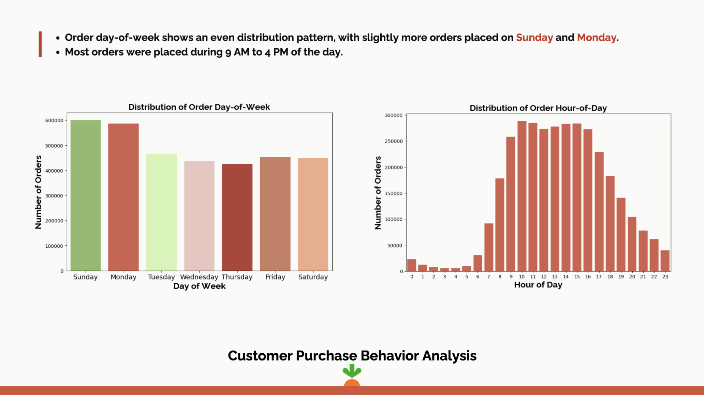
    
  <li><b>Customer Loyalty:</b>
    <ul>
      <li>Majority place only one order, but a small loyal segment places over 100 orders.</li>
      <li>Reorder patterns peak at 7 and 30 days.</li>
    </ul>
  </li>
  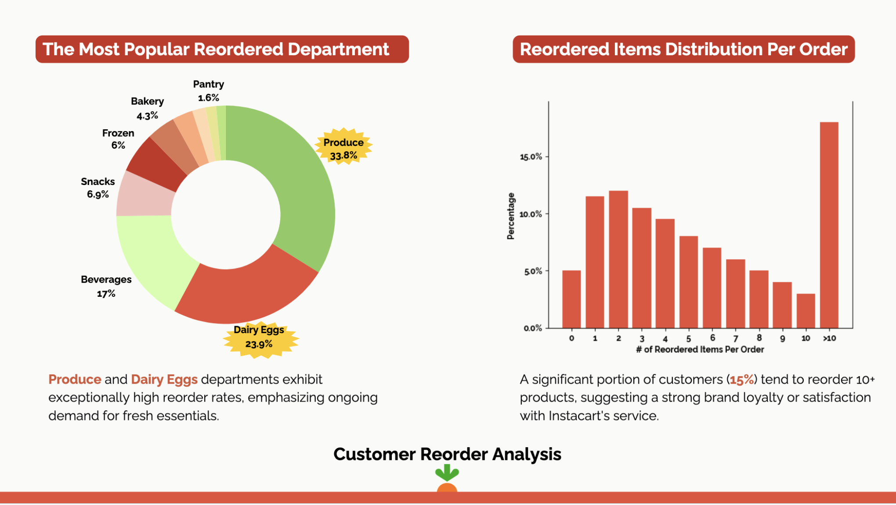
  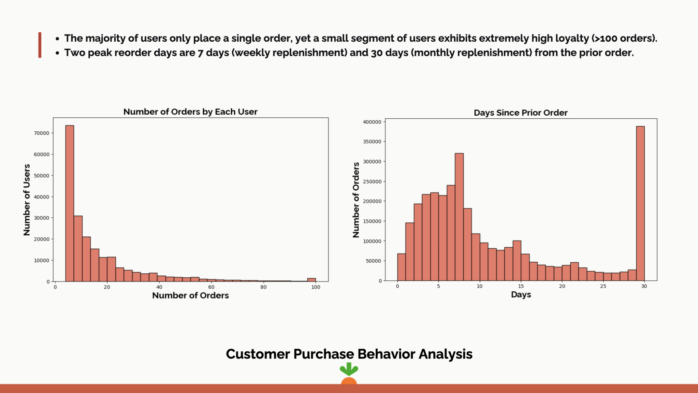
    
  <li><b>Popular Reordered Departments:</b> Produce (33.8%) and Dairy & Eggs (23.9%) dominate reorders, showing demand for fresh essentials.</li>
  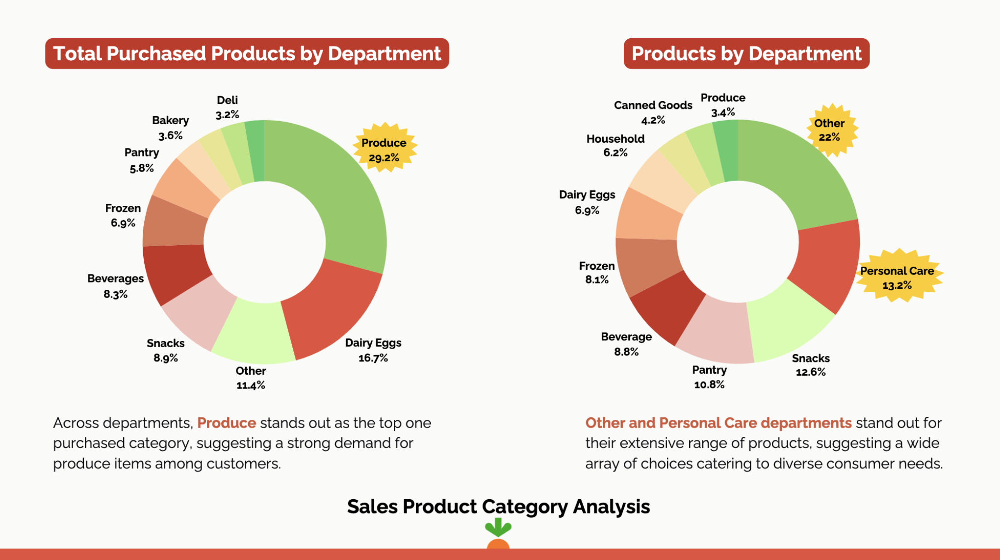
</ol>

<h2 id="model-development">⚙️ Model Development</h2>
<h4>From Baseline to Advanced Model:</h4>

I began with a baseline Logistic Regression model to establish initial performance metrics. Key improvements made to transition to an advanced XGBoost model included:

<ul>
  <li><b>Feature Engineering:</b>
    <ul>
      <li>Added user-level features like reorder rate and average days between orders.</li>
      <li>Incorporated product-specific features like product popularity and reorder frequency.</li>
      <li>Included order-level features such as order size and order timing.</li>
    </ul>
    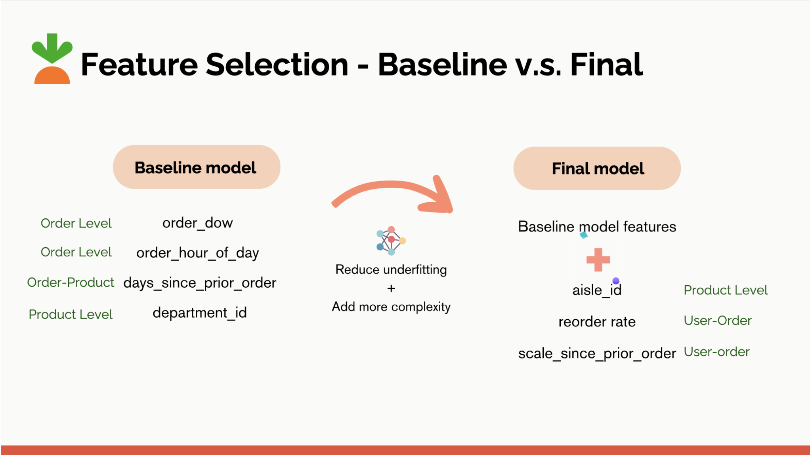
    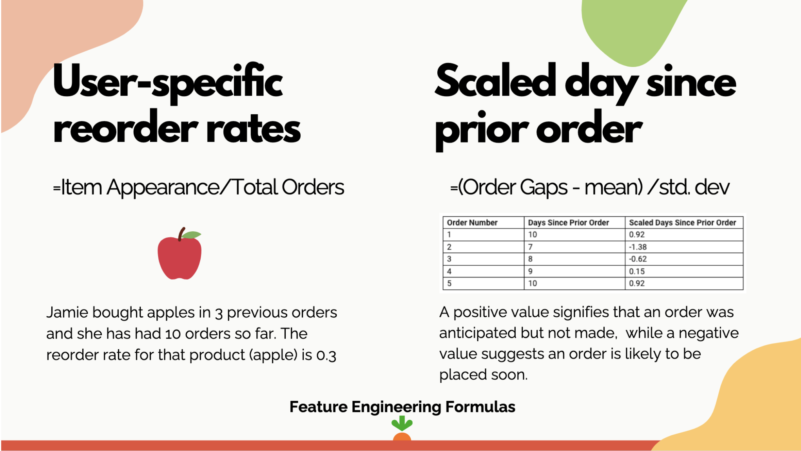

  </li>
  <li><b>Handling Imbalanced Data:</b> Applied techniques like oversampling reorders and optimizing thresholds to balance sensitivity and specificity.</li>
  <li><b>Hyperparameter Tuning:</b> Performed grid search and cross-validation on the XGBoost model to optimize parameters like learning rate, max depth, and number of estimators.</li>
  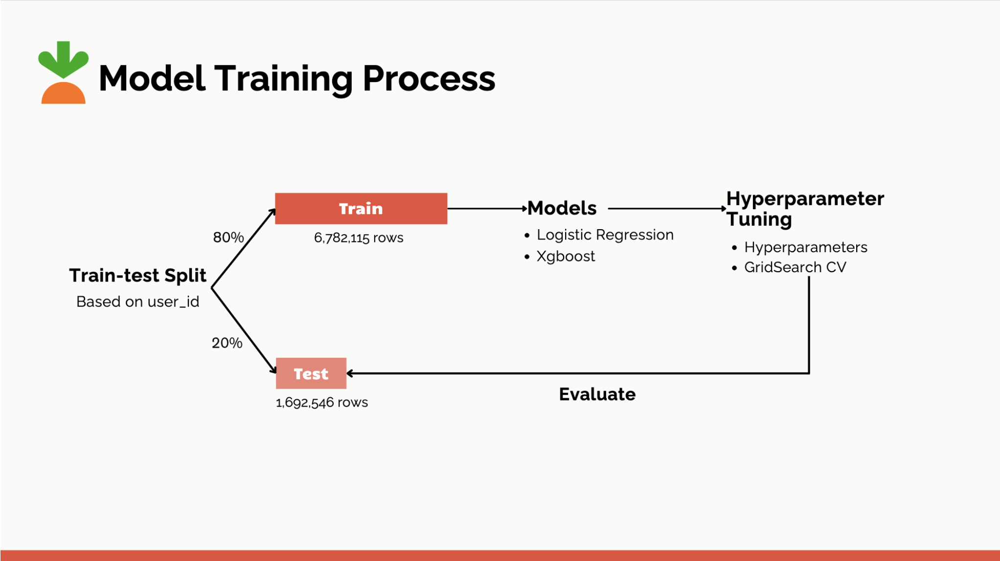
  <li><b>Evaluation Refinement:</b> Focused on sensitivity and AUC to capture business-critical predictions (i.e., accurately predicting reordered products).</li>
</ul>

<h4>Evaluation Metrics:</h4>

The models were evaluated using the following metrics:

<ul>
  <li><b>Accuracy:</b> Overall correctness of predictions.</li>
  <li><b>Sensitivity (Recall):</b> Ability to capture reordered products (True Positives).</li>
  <li><b>Specificity:</b> Ability to correctly identify non-reorders (True Negatives).</li>
  <li><b>Precision:</b> Ratio of correctly predicted reorders to all predicted reorders.</li>
  <li><b>F1-Score:</b> Harmonic mean of precision and sensitivity.</li>
  <li><b>AUC-ROC:</b> Trade-off between sensitivity and specificity.</li>
</ul>

<h2 id="results-and-visualizations">🧪 Results & Visualizations</h2>
<ol>
  <li><b>Logistic Regression Improvement:</b>
    <ul>
      <li>Sensitivity increased to ~70%, with balanced specificity and AUC.</li>
    </ul>
    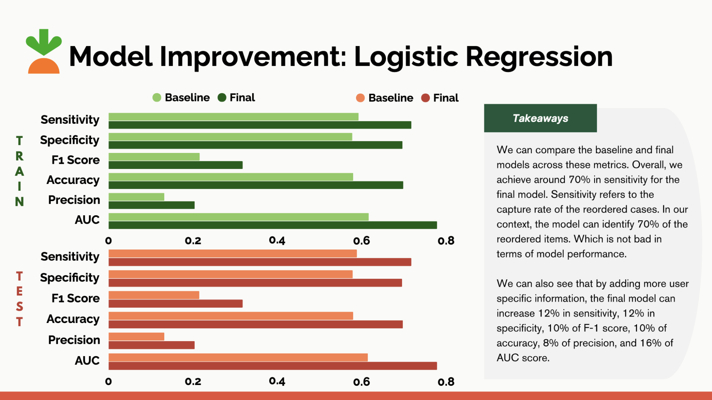
  </li>
   
  <li><b>XGBoost Performance:</b>
    <ul>
      <li>Achieved ~78% AUC with improved sensitivity and precision.</li>
      <li>Feature importance revealed "aisle_id" and "department_id" as critical drivers.</li>
    </ul>
    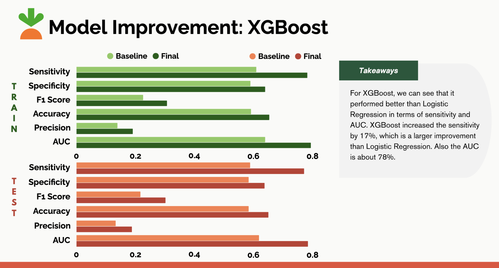
    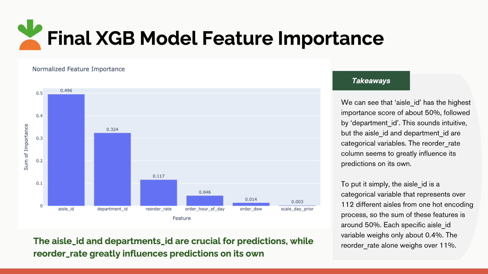
  </li>
   
  <li><b>AUC Comparison:</b> Significant improvement observed between logistic regression and XGBoost models.</li>
  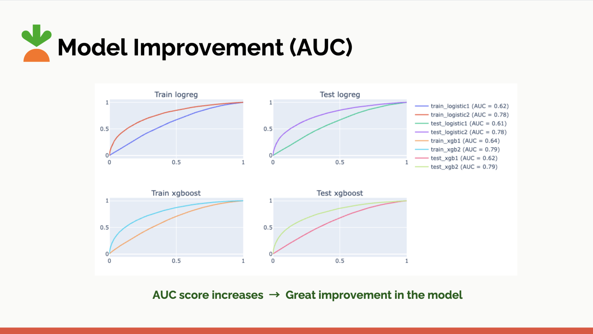
</ol>

<h2 id="repository-structure">📂 Repository Structure</h2>
<pre>
├── notebooks/       # Jupyter notebooks for EDA, modeling, and insights.  
├── src/             # Python scripts for data processing and custom utilities.  
├── data/            # Placeholder (data not included due to competition rules).  
├── reports/         # Visualizations, insights, and final results.  
└── README.md        # Project description and usage details.  
</pre>

<h2>🎯 Key Takeaways</h2>
<ul>
  <li>XGBoost demonstrated superior performance compared to Logistic Regression with a 17% increase in sensitivity and ~16% AUC improvement.</li>
  <li>Insights into customer behavior provide actionable business opportunities for Instacart.</li>
</ul>

Feel free to explore the repository for detailed notebooks, visualizations, and code implementation. 🎉

